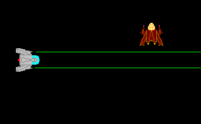



## a bit blt example \(with spaceships\)

### Description

Yes I know, another bitblt! But on psc the ones I found were all either very advanced or very simple. I tried to land somewhere in the middle. the code is commented and well organized, so hopefully someone can find it usefull. (Screen shot failed to load)
 
### More Info
 

             |
---                |---
**Submitted On**   |2004-08-12 13:20:18
**By**             |[Brian\_A ](https://github.com/Planet-Source-Code/PSCIndex/blob/master/ByAuthor/brian-a.md)
**Level**          |Beginner
**User Rating**    |5.0 (10 globes from 2 users)
**Compatibility**  |VB 6\.0
**Category**       |[Graphics](https://github.com/Planet-Source-Code/PSCIndex/blob/master/ByCategory/graphics__1-46.md)
**World**          |[Visual Basic](https://github.com/Planet-Source-Code/PSCIndex/blob/master/ByWorld/visual-basic.md)
**Archive File**   |[a\_bit\_blt\_1781198122004\.zip](https://github.com/Planet-Source-Code/brian-a-a-bit-blt-example-with-spaceships__1-55513/archive/master.zip)

